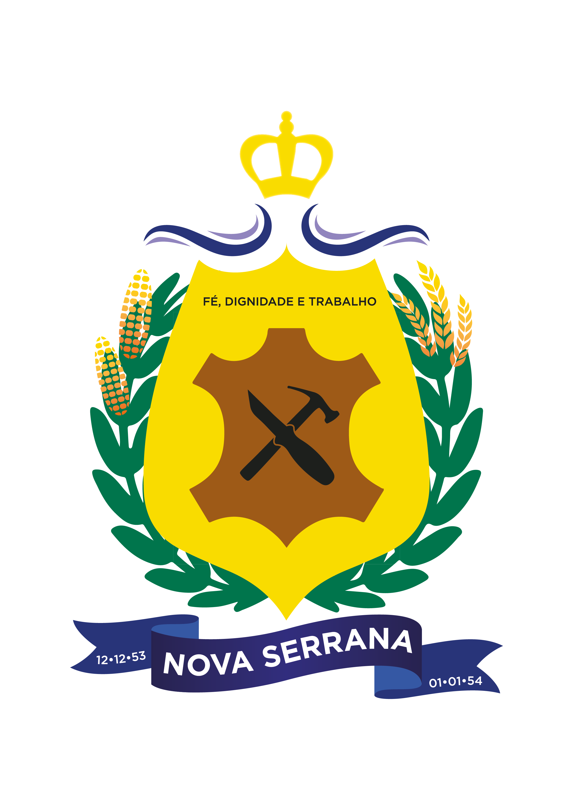
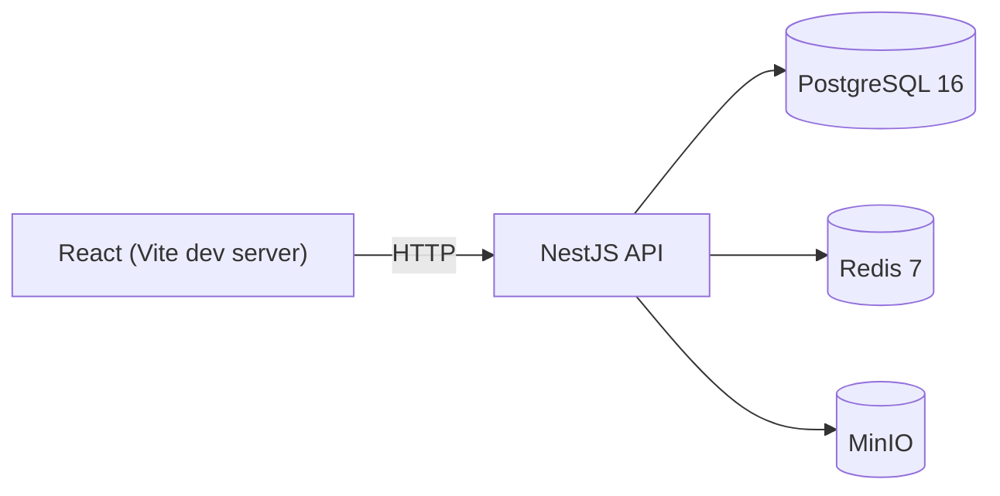

<div align="center">



# MuniChat

### Real-Time Municipal Chat Platform

*Powered by Prefeitura Municipal de Nova Serrana · MG*


</div>

A self-hosted, real-time chat platform for a municipal government — replacing WhatsApp/Spark with Active Directory authentication, department-based channels, and GLPI ticket creation from chat.

**Status: Phase 1 (Foundation) complete.** Monorepo scaffold, local dev data services, database schema, a live health-checked API, and a routed React shell are in place. Chat, auth, and ticketing land in later phases — see [Roadmap](#roadmap).

## Tech Stack

| Layer | Technology |
|---|---|
| Backend | Node.js 20+, NestJS (TypeScript), Socket.IO |
| Frontend | React 18 + TypeScript, Vite, TanStack Query, Zustand, Tailwind CSS, shadcn/ui |
| Database | PostgreSQL 16 + Prisma ORM |
| Cache / PubSub | Redis 7 |
| File storage | MinIO (S3-compatible) |
| Directory auth | Active Directory via LDAPS (`ldapts`) |
| Ticketing | GLPI REST API |
| Dev environment | Docker Compose |
| Testing | Jest, Supertest, Vitest, React Testing Library |

## Architecture (Phase 1)



See [docs/architecture.md](docs/architecture.md) for details, and for how this diagram grows in later phases.

## Prerequisites

- Node.js 20+ (developed against v24)
- npm 10+
- Docker Desktop (or another Docker Compose-compatible engine)

## Quick Start

```bash
npm install
cp .env.example .env
npm run docker:up          # starts postgres, redis, minio
npm run prisma:migrate     # applies the schema to postgres
npm run dev                # starts packages/shared (watch), the API, and the web app
```

- API: http://localhost:3000 (health check at `/health`)
- Web: http://localhost:5173
- MinIO console: http://localhost:9001

## Project Structure

```
munichat/
├── apps/
│   ├── api/          # NestJS backend
│   └── web/          # React frontend
├── packages/
│   └── shared/       # shared TS types (DTOs, socket event contracts)
├── docker/
│   └── docker-compose.yml
├── docs/
│   └── architecture.md
└── README.md
```

## Environment Variables

All configuration lives in a single root `.env` (copied from `.env.example`). Docker Compose, the NestJS `ConfigModule`, Vite, and the Prisma CLI (via `dotenv-cli`) all read from this one file — see `.env.example` for the current variable list.

## Scripts (run from repo root)

| Script | Description |
|---|---|
| `npm run dev` | Run `packages/shared` (watch), the API, and the web app concurrently |
| `npm run build` | Build all workspaces |
| `npm run lint` / `lint:fix` | Lint all workspaces |
| `npm run typecheck` | Typecheck all workspaces |
| `npm run test` | Run unit tests in all workspaces |
| `npm run docker:up` / `docker:down` / `docker:logs` | Manage the local data services |
| `npm run prisma:migrate` / `prisma:generate` / `prisma:studio` | Prisma CLI wrappers (via `dotenv-cli`) |

Run `npm run test:e2e -w apps/api` for the API's end-to-end tests (requires the Docker data services to be running).

## Testing

- `apps/api` — Jest for unit tests (`npm run test -w apps/api`), Supertest-based e2e tests against a real Postgres instance (`npm run test:e2e -w apps/api`).
- `apps/web` — Vitest + React Testing Library (`npm run test -w apps/web`).
- `packages/shared` — Vitest for DTO/schema validation.
- CI (`.github/workflows/ci.yml`) runs lint, typecheck, and tests on every push and pull request against `main`, using a real Postgres service container.

## Roadmap

- [x] **Phase 1 — Foundation**: monorepo, Docker Compose data services, Prisma schema, NestJS health check, React skeleton, CI.
- [x] **Phase 2 — Auth**: Active Directory (LDAPS) login, JWT sessions, channel sync from `memberOf`.
- [ ] **Phase 3 — Chat core**: Socket.IO gateway, message history, channels UI, presence, typing indicators.
- [ ] **Phase 4 — Rich content**: file uploads (MinIO), link previews, message edit/delete/reply.
- [ ] **Phase 5 — GLPI**: `/ticket` slash command, ticket cards, webhook-driven status updates.
- [ ] **Phase 6 — Polish**: PWA, browser notifications, full-text search, rate limiting, production Docker images.
