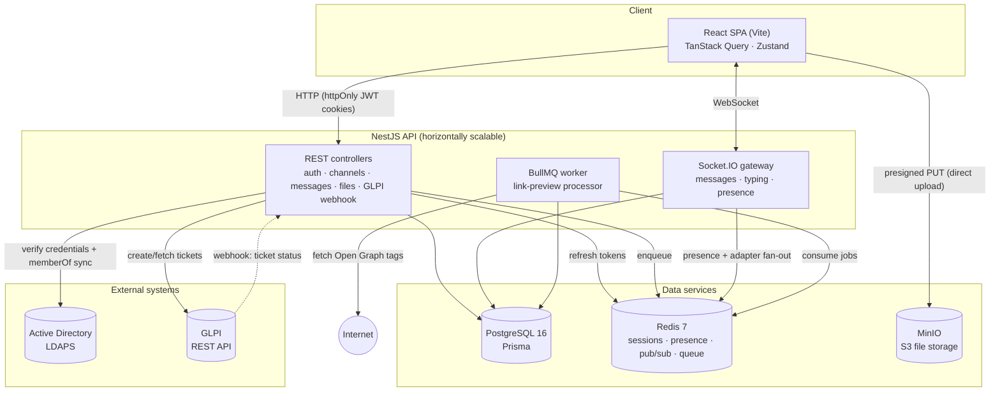

<div align="center">


# MuniChat

### Real-Time Municipal Chat Platform

*Powered by Prefeitura Municipal de Nova Serrana · MG*


</div>

A self-hosted, real-time chat platform for a municipal government — replacing WhatsApp/Spark with Active Directory authentication, department-based channels, and GLPI ticket creation from chat.

**Status: Phases 1–6 complete.** Active Directory login, real-time chat (presence, typing, edit/delete/reply), file uploads, link previews, GLPI ticketing, full-text message search, Redis-backed rate limiting, browser notifications, and PWA installability are all working, and the app ships with production Docker images and Kubernetes manifests. See [Roadmap](#roadmap) for the precise breakdown.

## Tech Stack

| Layer | Technology |
|---|---|
| Backend | Node.js 20+, NestJS (TypeScript), Socket.IO |
| Frontend | React 18 + TypeScript, Vite, TanStack Query, Zustand, Tailwind CSS, shadcn/ui |
| Database | PostgreSQL 16 + Prisma ORM |
| Cache / PubSub | Redis 7 |
| File storage | MinIO (S3-compatible) |
| Directory auth | Active Directory via LDAPS (`ldapts`) |
| Ticketing | GLPI REST API |
| Dev environment | Docker Compose |
| Testing | Jest, Supertest, Vitest, React Testing Library |

## Architecture



**How the pieces fit:**

- **Web** — a single React SPA. Server state is cached with TanStack Query; live chat state lives in a small Zustand store. One Socket.IO connection is opened only after login. File uploads go **straight to MinIO** via presigned URLs — the API signs the URL and later validates the object, but never proxies the bytes.
- **API** — one NestJS app exposing both REST controllers and a Socket.IO gateway. The gateway authenticates in the WebSocket handshake using the **same** access-token validator as the HTTP layer, so REST and realtime auth can't drift. It scales horizontally: `@socket.io/redis-adapter` fans `emit`s out across instances via Redis pub/sub.
- **PostgreSQL** — the system of record (User, Channel, ChannelMember, Message, Attachment, LinkPreview, TicketRef, AuditLog) via Prisma, with keyset-paginated message history.
- **Redis** — refresh-token store (rotation/revocation), online-presence counters + set, the Socket.IO adapter's pub/sub channel, and the BullMQ queue backend.
- **BullMQ worker** — link previews are processed off the request path: sending a message with a URL enqueues a job; a worker fetches the page's Open Graph tags (behind an SSRF guard) and persists the preview.
- **Active Directory (LDAPS)** — login binds against AD; department channels are provisioned from the user's `memberOf` groups on each login.
- **GLPI** — `/ticket` in chat creates a helpdesk ticket over GLPI's REST API; an inbound, HMAC-signed webhook pushes ticket-status updates back into the channel in realtime.

See [docs/architecture.md](docs/architecture.md) for the full write-up and [docs/estrutura-do-codigo.md](docs/estrutura-do-codigo.md) for a module-by-module walkthrough (pt-BR).

## Prerequisites

- Node.js 20+ (developed against v24)
- npm 10+
- Docker Desktop (or another Docker Compose-compatible engine)

## Quick Start

```bash
npm install
cp .env.example .env
npm run docker:up          # starts postgres, redis, minio
npm run prisma:migrate     # applies the schema to postgres
npm run dev                # starts packages/shared (watch), the API, and the web app
```

- API: http://localhost:3000 (health check at `/health`)
- Web: http://localhost:5173
- MinIO console: http://localhost:9001

## Project Structure

```
munichat/
├── apps/
│   ├── api/                # NestJS backend (REST + Socket.IO)
│   │   ├── prisma/         # schema + migrations
│   │   └── src/            # auth, channels, messages, chat, files,
│   │                       #   link-preview, glpi, health, users, redis, queue
│   └── web/                # React frontend (Vite SPA)
├── packages/
│   └── shared/             # shared DTOs (Zod) + socket event contracts
├── docker/                 # local dev services (postgres, redis, minio, openldap)
├── k8s/                    # Kubernetes manifests (production)
├── docs/                   # architecture + pt-BR docs
└── README.md
```

## Environment Variables

All configuration lives in a single root `.env` (copied from `.env.example`). Docker Compose, the NestJS `ConfigModule`, Vite, and the Prisma CLI (via `dotenv-cli`) all read from this one file — see `.env.example` for the current variable list.

## Scripts (run from repo root)

| Script | Description |
|---|---|
| `npm run dev` | Run `packages/shared` (watch), the API, and the web app concurrently |
| `npm run build` | Build all workspaces |
| `npm run lint` / `lint:fix` | Lint all workspaces |
| `npm run typecheck` | Typecheck all workspaces |
| `npm run test` | Run unit tests in all workspaces |
| `npm run docker:up` / `docker:down` / `docker:logs` | Manage the local data services |
| `npm run prisma:migrate` / `prisma:generate` / `prisma:studio` | Prisma CLI wrappers (via `dotenv-cli`) |

Run `npm run test:e2e -w apps/api` for the API's end-to-end tests (requires the Docker data services to be running).

## Testing

- `apps/api` — Jest for unit tests (`npm run test -w apps/api`), Supertest-based e2e tests against a real Postgres instance (`npm run test:e2e -w apps/api`).
- `apps/web` — Vitest + React Testing Library (`npm run test -w apps/web`).
- `packages/shared` — Vitest for DTO/schema validation.
- CI (`.github/workflows/ci.yml`) runs lint, typecheck, unit + e2e tests, and Docker image builds on every pull request, using real Postgres, Redis, OpenLDAP, and MinIO service containers.

## Roadmap

- [x] **Phase 1 — Foundation**: monorepo, Docker Compose data services, Prisma schema, NestJS health check, React skeleton, CI.
- [x] **Phase 2 — Auth**: Active Directory (LDAPS) login, JWT sessions, channel sync from `memberOf`.
- [x] **Phase 3 — Chat core**: Socket.IO gateway, message history, channels UI, presence, typing indicators.
- [x] **Phase 4 — Rich content**: file uploads (MinIO), link previews, message edit/delete/reply.
- [x] **Phase 5 — GLPI**: `/ticket` slash command, ticket cards, webhook-driven status updates.
- [x] **Phase 6 — Polish**: production Docker images and Kubernetes manifests, Postgres full-text message search, Redis-backed request rate limiting, browser notifications, and PWA installability (offline app shell).
- [ ] **Phase 7 — Future**: see [docs/ideias-futuras.md](docs/ideias-futuras.md) for candidate features (reactions, read receipts, DMs, admin panel, observability, and more).

> **Note on this roadmap:** items are checked only when the corresponding code exists in this repository. Phases 4 and 5 were previously left unchecked here despite being merged (PRs #3 and #4) — verify PR merge state independently rather than trusting this checklist alone.
