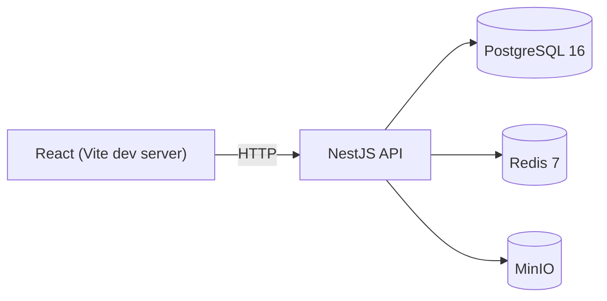
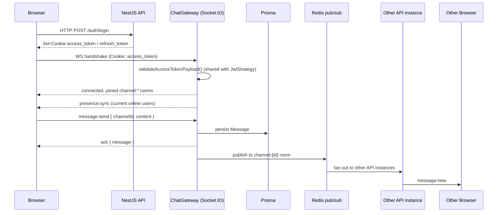

# Architecture

> This document reflects the current state of the system and grows with each build phase.

## Phase 1 — Foundation

- **Web** — React 18 + TypeScript SPA served by Vite in dev mode. Talks to the API over plain HTTP for now (no sockets yet).
- **API** — NestJS app exposing a single `GET /health` endpoint backed by a real Prisma → Postgres round trip via `@nestjs/terminus`.
- **Postgres** — holds the full data model (User, Channel, ChannelMember, Message, Attachment, LinkPreview, TicketRef, AuditLog) via Prisma migrations, even though only the schema exists so far — no feature writes to it yet.
- **Redis** — running and healthy, not yet wired into any application code (arrives with the Socket.IO adapter and session storage in Phase 3).
- **MinIO** — running and healthy with an auto-created bucket, not yet wired into any application code (arrives with file uploads in Phase 4).

`packages/shared` provides TypeScript types shared between `apps/api` and `apps/web`, built to `dist/` and consumed as a normal npm workspace dependency by both apps. In Phase 1 it only carries the Prisma enum mirrors and the `HealthResponse` zod DTO.

## Phase 3 — Chat core

- **Socket.IO gateway** (`apps/api/src/chat/chat.gateway.ts`) — one `@WebSocketGateway`, authenticated via an `io.use()` handshake middleware (`ChatAuthService`) rather than post-connect checks, so a failed auth surfaces to the client as `connect_error` and never a false `connect`. On connection, a socket joins a `channel:{id}` room for every channel the user belongs to (memberships only change via AD sync at login, not mid-session). Handles `message:send` (persists via `MessagesService`, relays `message:new` to the room, acks the sender), `typing:start`/`typing:stop` (stateless relay, no server-side tracking), and presence (`PresenceService`, backed by two Redis structures: a per-user counter for multi-tab correctness and an online-user Set).
- **Shared auth path** — `apps/api/src/auth/access-token.validator.ts` holds the single "is this access token payload still valid" check (user active, `tokenVersion` matches); both the HTTP `JwtStrategy` and `ChatAuthService` call it, so REST and WebSocket auth can never drift apart.
- **Horizontal scaling** — `RedisIoAdapter` (`apps/api/src/chat/redis-io.adapter.ts`) wraps Socket.IO's default adapter with `@socket.io/redis-adapter`, using two dedicated `ioredis` connections (pub/sub) separate from the app's own `RedisService` client. This is what lets `socket.to(room).emit(...)` reach a socket connected to a different API instance.
- **REST endpoints** — `GET /channels`, `GET /channels/:id/members`, and `GET /channels/:channelId/messages` (keyset-paginated, oldest→newest per page) back the initial channel list and message history load; the gateway is only used for live traffic (sending, typing, presence) after that.
- **Web** — `SocketProvider` owns the single `socket.io-client` connection for the whole authenticated app, mounted inside the chat layout (never before login, so `/login` never opens a socket). It listens for `message:new`/`presence:*` and pushes them into React Query's cache / a small Zustand `useChatStore`; a `connect_error` clears the cached current user the same way a REST 401 does, so `ProtectedRoute` redirects identically either way.

## Not yet present

Active Directory / LDAPS auth, department channel sync, GLPI ticket integration, file uploads, and link previews are out of scope for Phase 1 — see the module `README.md` stubs under `apps/api/src/*` for which phase implements each one.
